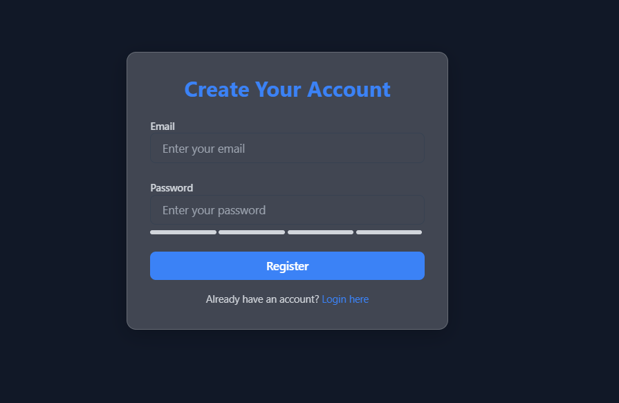
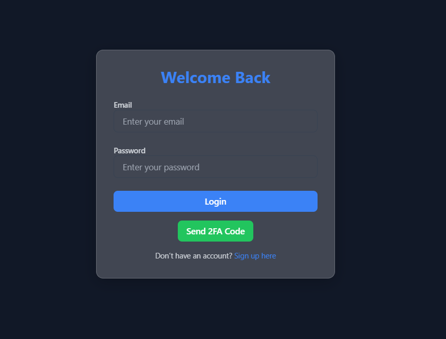

# **2FA Authentication System**

## **Overview**
A secure and modern two-factor authentication (2FA) system built using **HTML**, **CSS (Tailwind)**, **JavaScript**, and **Node.js**. This project demonstrates a stylish, responsive user interface combined with a robust backend, ensuring advanced security standards and a seamless user experience.






## **Features**

### **Frontend**
- **Glassmorphism Design**: Transparent and modern aesthetic.
- **Stylish Forms**: Animated input fields with real-time validation.
- **Smooth Animations**: Button hover effects, ripple animations, and page transitions.
- **Responsive UI**: Optimized for mobile, tablet, and desktop screens.

### **Backend**
- **User Registration & Login**: Secure authentication flow with email and password.
- **Two-Factor Authentication (2FA)**:
  - Generates time-sensitive 2FA codes valid for 5 minutes.
  - Sends codes via email with validation feedback.
- **Security Emphasis**:
  - Hashed passwords (using **bcrypt**).
  - JWT-based token authentication.
  - Masked 2FA input with an option to reveal.

---

## **Tech Stack**
- **Frontend**: HTML, Tailwind CSS, JavaScript.
- **Backend**: Node.js, Express.js, MongoDB.
- **Utilities**:
  - Email delivery via **Nodemailer**.
  - Random 2FA code generation.
- **Testing**: Unit testing with **Jest**.


## **How to Run**

### **Frontend**
1. Navigate to the `/frontend` directory.
2. Open `index.html` in your browser.

### **Backend**
1. Clone the repository:  
   ```bash
   git clone https://github.com/your-username/2fa-auth-system.git
   cd 2fa-auth-system/backend
   ```
2. Install dependencies:  
   ```bash
   npm install
   ```
3. Configure environment variables in `.env`:
   ```plaintext
   PORT=5000
   MONGO_URI=your_mongo_connection_string
   JWT_SECRET=your_jwt_secret
   EMAIL_HOST=smtp.example.com
   EMAIL_PORT=587
   EMAIL_USER=your_email@example.com
   EMAIL_PASS=your_password
   ```
4. Start the server:  
   ```bash
   npm start
   ```
5. The backend will be available at `http://localhost:5000`.

---

## **Usage**
1. **Register**: Create an account using the registration form.
2. **Login**: Authenticate with email and password.
3. **2FA Verification**: Enter the emailed 2FA code to complete login.

---

## **License**
This project is open-source and available under the [MIT License](LICENSE).

---

## **Contributing**
Pull requests are welcome! For significant changes, open an issue to discuss your ideas.
```
